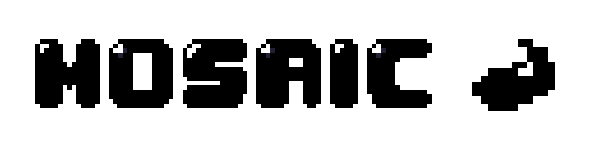

Mosiac
======

======

A simple web app to convert normal images to pixel art, built with [Flask](https://flask.palletsprojects.com/en/2.0.x/)

Try the app out [here](need link)

Features 
--------
- [ ] Base convertion of image to pixel art  
- [ ] Convertion of image to greyscale pixel-art  
- [ ] Restriction of image palette  
- [ ] Image library and image saving/storage  
